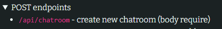
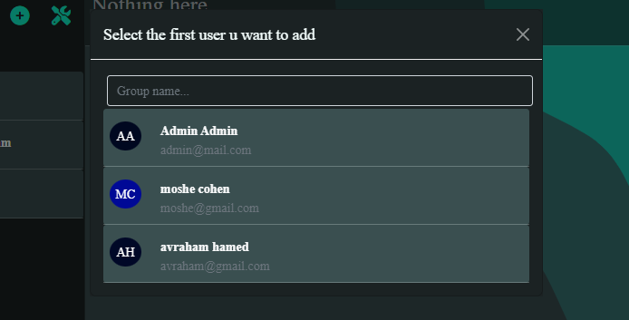
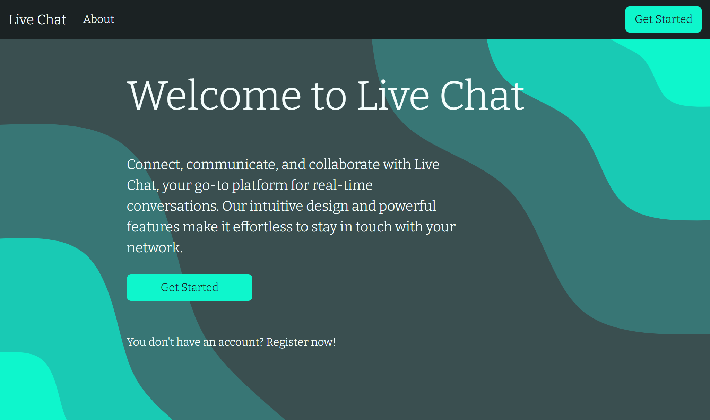
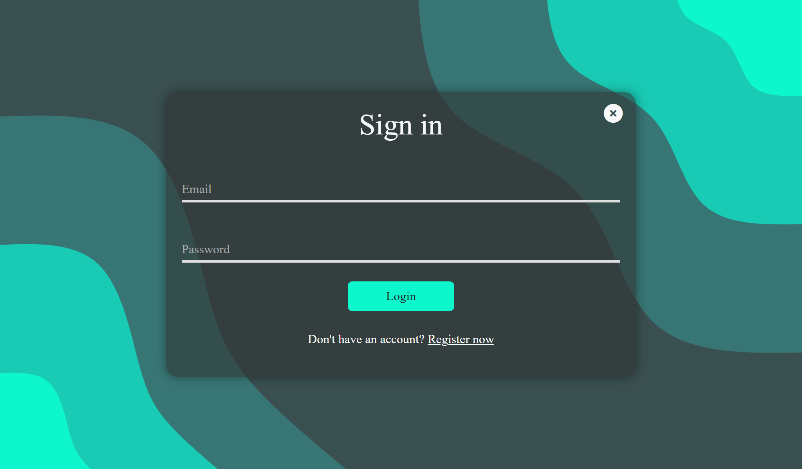
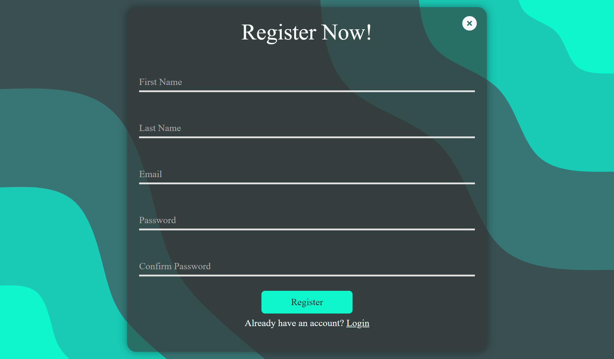
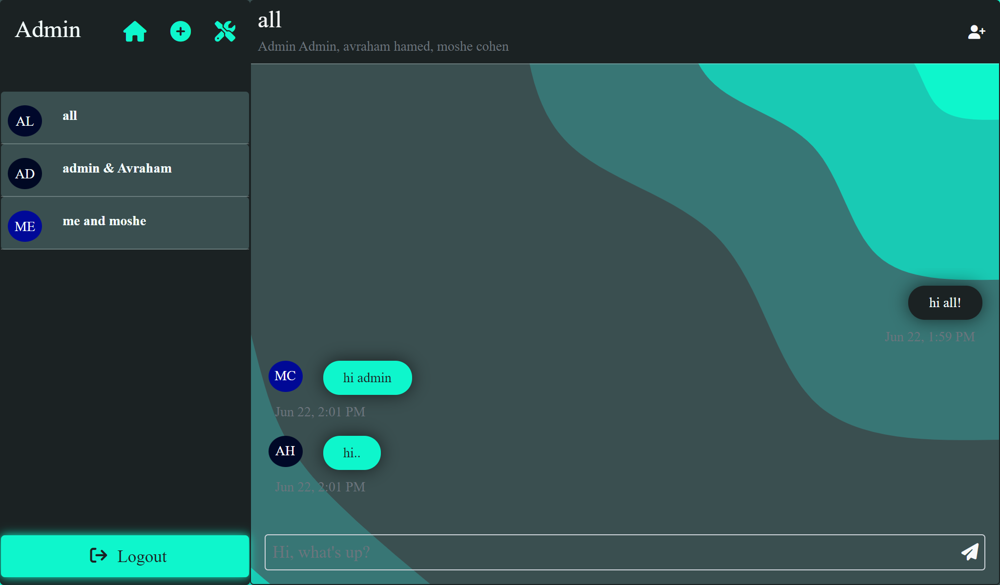
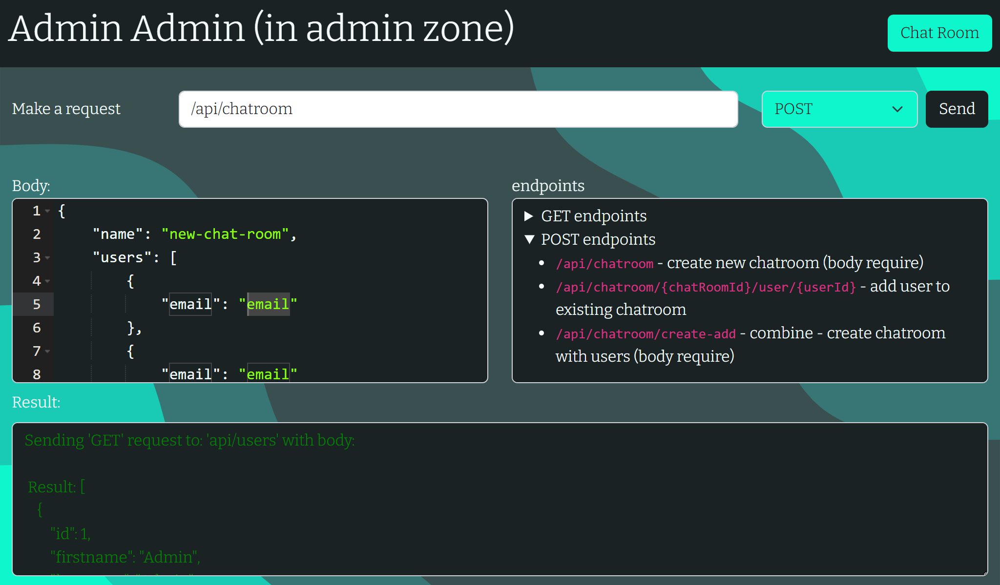

# Live Chat


## Description
This project is a live chat application that allows users to create chat rooms and chat with other users in real time. The application is built using Java, Spring Boot, and Thymeleaf.

## How to Run
1. Clone the repository
2. Open the project in IntelliJ
3. Reload The Maven Project
4. Open the `XAMPP` application and start the `Apache` and `MySQL` modules
5. Create a database called `ex5` in `phpMyAdmin`
6. Run the `EX5TemplateApplication` file

<b> the Application will create for u a new user with admin permissions:</b>

* password: admin-pw
* email: admin@mail.com

### General information
* The application is built using Java, Spring Boot, and Thymeleaf.
* The application uses the `Spring Security` framework for authentication and authorization.
* The application uses the `Spring Data JPA` framework for database access.
* The application uses the `MySQL` database.
* The application uses the `Bootstrap` framework for styling.
* The application uses the `jQuery` library for JavaScript.

## How to Use
1. Create a new account by clicking the `register now` button, if u have account just go to `Get Started` button.
2. Login to your account
3. Add new People u want to chat with by clicking the `+` Icon
4. You can also add new people to existing chats by clicking the `+` Icon in the chat.

## Features
* Create new chat rooms
* Add new people to existing chat rooms
* Send messages in real time
* Delete messages (only visible for admin)
* Delete chat rooms (only visible for admin)
* Delete users (only visible for admin)
* if You are admin you can see all the users and chat rooms in the system, there is a button u can go and the dashboard like an api, the endpoint visible to u.


## Useful information
* to use the API u can click on the  icon.
* when u get the api-page u can click on one of this 
* this automatic copy the endpoint to the request input.
* u can select each methode u want to use in the option at the top-right.
* the response will be in the bottom of the page.
* also there is a body when u do a post request u can add the body in the bottom of the page.
* when u select some - post methode, this automatic give u a default body to use, u can change it if u want.
* the body is in json format.
*  here u can create new chat room.
* u will see this modal:



* note that the name must be at least 2 characters long.
* u can select one user (can be u) to chat with.
* after that u can add more users to this chat-room by clicking  at the top-right of the chat.
* note that the admin created automatically when u run the application, u can see the admin in the users list.
* there is a function `destroy`, the function turned off by default,
but if u want to activate it, uncomment the `@PreDestroy` annotation.

### Error Handling
* the error handling automatically by thymeleaf.
* there is 404 error page, in error folder.
* there is 403 error page, in error folder.
* there is general error handling, `error.html` file, in main folder.
* all of this <b>automatically</b> by thymeleaf.
so if the user go to admin - he will get the access denied page,
and if he will go to random - not exist page, he will get the 404 page.
if some unknown error will happen, he will get the general error page.
* important! - the code (in `AppConfig` class):

```java
exceptionHandling((exception) -> exception
                        .accessDeniedPage("/accessDenied"));
```
necessary need to be deleted, because it returned the 403 page,
even if the page doesn't exist, and even the user registered, 
so - when I deleted this if the user not registered he will
automatically get the sign-in page, in other case he will get the 404 page or 403.

## Screenshots

### Home Page


### Login Page


### Register Page


### Chat Room Page


### API Page



## Note!

there is no requirement to do Long Polling, so I didn't do it.
